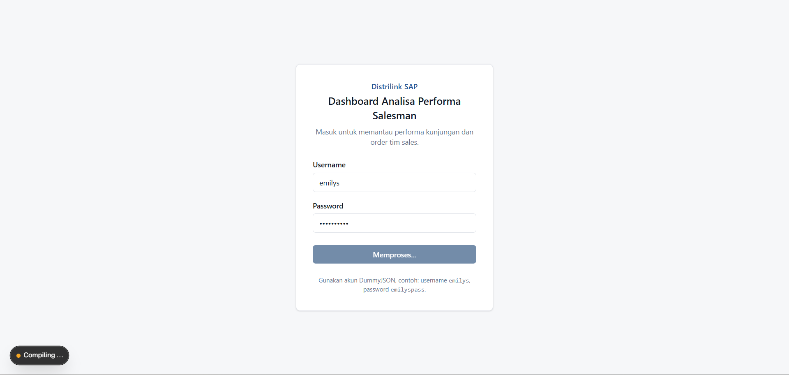
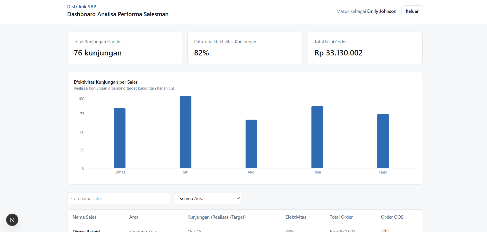

# Distrilink SAP

Dashboard yang dipakai supervisor untuk memantau performa kunjungan dan order
harian tim sales.

## Screenshot

<table>
  <tr>
    <td width="50%"><br /><sub>Login</sub></td>
    <td width="50%"><br /><sub>Dashboard</sub></td>
  </tr>
</table>

## Demo

[Live Demo Distrilink](https://distrilink-sales.vercel.app/)

## Overview

Aplikasi ini punya dua halaman:

- **Login** — terhubung ke API publik [DummyJSON](https://dummyjson.com/docs/auth) untuk
  autentikasi.
- **Dashboard** — menampilkan ringkasan performa tim, tabel detail per sales, chart
  perbandingan efektivitas kunjungan, serta pencarian/filter. Data sales memakai dataset
  lokal yang diberikan di dokumen test case (tidak tersedia di API mana pun).

## Fitur

- Login dengan username & password, memanggil `POST /auth/login` DummyJSON secara
  langsung (bukan simulasi)
- Loading state saat request login berlangsung, dan pesan error yang jelas kalau
  kredensial salah atau request gagal
- Dashboard hanya bisa diakses setelah login; kalau belum login, otomatis diarahkan ke
  halaman Login
- Nama user yang login ditampilkan di header dashboard
- Logout menghapus session dan mengembalikan ke halaman Login
- Summary card: total kunjungan hari ini, rata-rata efektivitas kunjungan tim, total
  nilai order — semuanya dihitung dari dataset, bukan angka statis
- Bar chart efektivitas kunjungan per sales
- Pencarian nama sales dan filter berdasarkan area, memengaruhi tabel & chart
- Tampilan responsif untuk desktop, tablet, dan mobile

## Tech Stack

- [Next.js 16](https://nextjs.org/) (App Router)
- TypeScript
- Tailwind CSS v4
- [Recharts](https://recharts.org/) — untuk bar chart
- DummyJSON — API publik untuk login

Tidak ada backend/database sendiri. Semua data sales adalah data lokal statis sesuai
requirement test case.

## Cara Menjalankan

### Instalasi

```bash
npm install
```

### Development

```bash
npm run dev
```

Buka [http://localhost:3000](http://localhost:3000) — akan otomatis diarahkan ke `/login`.

### Build production

```bash
npm run build
npm run start
```

## Login untuk Testing

Gunakan salah satu akun dari DummyJSON, contohnya:

| Username | Password   |
| -------- | ---------- |
| emilys   | emilyspass |

Akun lain bisa dicek langsung di `GET https://dummyjson.com/users` (setiap user punya
field `username` dan `password`).

## API yang Digunakan

- `POST https://dummyjson.com/auth/login` — login. Response sukses dipakai untuk
  mengisi nama user di dashboard; response gagal (400/401) ditangkap dan pesan
  error-nya ditampilkan di form login.

## Struktur Project

```
app/
  login/page.tsx        halaman login
  dashboard/page.tsx     halaman dashboard (protected, client component)
  layout.tsx, page.tsx   root layout & redirect ke /login
components/              komponen UI (login form, header, summary card, chart, dst)
data/
  sales-performance.ts   dataset sales + tipe SalesPerformance
lib/
  auth-api.ts            pemanggilan API login DummyJSON
  session.ts             simpan/baca/hapus session di localStorage
  sales-summary.ts        kalkulasi summary & logic filter data sales
  format.ts               format Rupiah & persen
```

Tidak ada folder `hooks/`, `store/`, atau layer state management terpisah — untuk
project sekecil ini, `useState` + dua-tiga fungsi murni di `lib/` sudah cukup dan lebih
mudah ditelusuri dibanding menambah abstraksi baru.

## Pendekatan Teknis

- **Session di localStorage, dicek di client.** Token login hanya disimpan di
  `localStorage` (sesuai saran di dokumen test case), bukan di cookie/server session.
  Konsekuensinya, proteksi halaman `/dashboard` dilakukan di client component saat
  halaman dimuat (cek session, redirect ke `/login` kalau tidak ada), bukan lewat
  Next.js middleware — karena middleware berjalan di server dan tidak bisa membaca
  `localStorage`. Untuk prototype ini trade-off-nya masuk akal; di aplikasi production
  sungguhan, session sebaiknya disimpan di HTTP-only cookie supaya bisa diverifikasi
  di middleware/server.
- **Summary dihitung dari seluruh dataset, tabel & chart mengikuti filter.** Summary
  card merepresentasikan performa tim secara keseluruhan, sehingga tetap dihitung dari
  semua data walau user sedang mencari/memfilter. Tabel dan chart menampilkan hasil
  yang sudah difilter, karena keduanya memang dipakai untuk melihat detail per sales.
- **Rata-rata efektivitas** dihitung sebagai rata-rata sederhana dari
  `efektivitas_visit_persen` tiap sales (bukan `total realisasi / total planned`),
  karena field tersebut sudah tersedia langsung di dataset dan lebih mudah dijelaskan.
- **Chart pakai Recharts** karena ringan, komponennya deklaratif, dan cukup umum
  dipakai di project React/Next.js sehingga mudah dirawat developer lain.
- **Tabel responsif dengan horizontal scroll** (bukan diubah jadi kartu di layar
  kecil) supaya semua kolom tetap bisa dibandingkan sejajar, dan implementasinya
  jauh lebih sederhana.

## Asumsi

- Field `kunjungan_unplanned` sempat disebut di deskripsi data lapangan, tapi tidak
  tersedia nilainya di dataset yang dipakai, jadi tidak ditampilkan di dashboard.
- "Total kunjungan hari ini" dihitung dari jumlah `kunjungan_realisasi` seluruh sales.
- Karena belum ada kebutuhan expiry/refresh token, `accessToken` dari DummyJSON hanya
  disimpan apa adanya di `localStorage` dan tidak dipakai untuk request lain di luar
  login.
